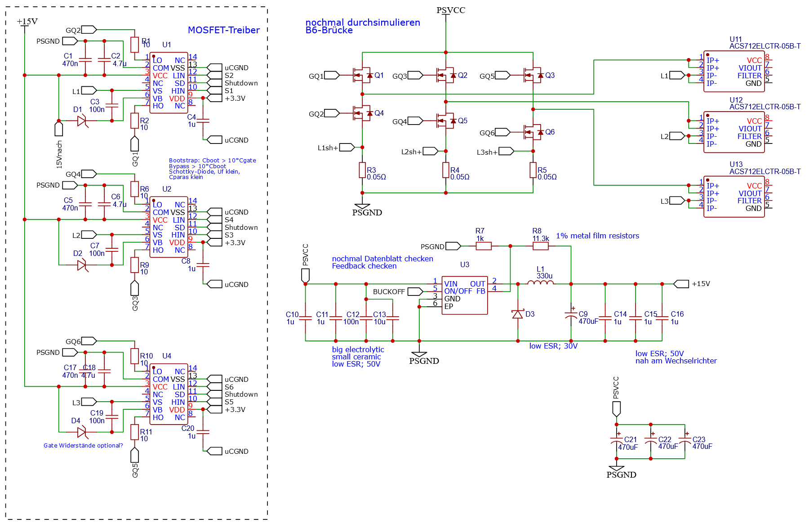
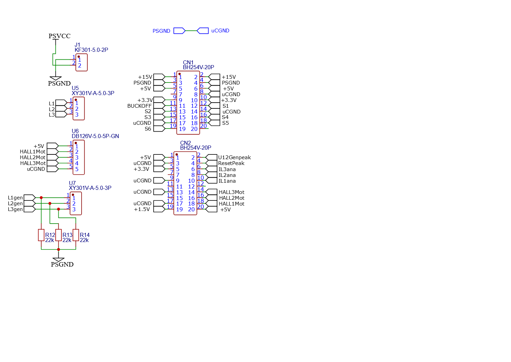
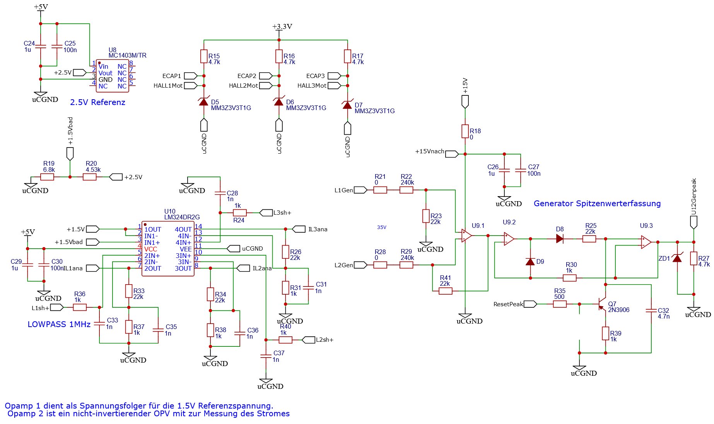
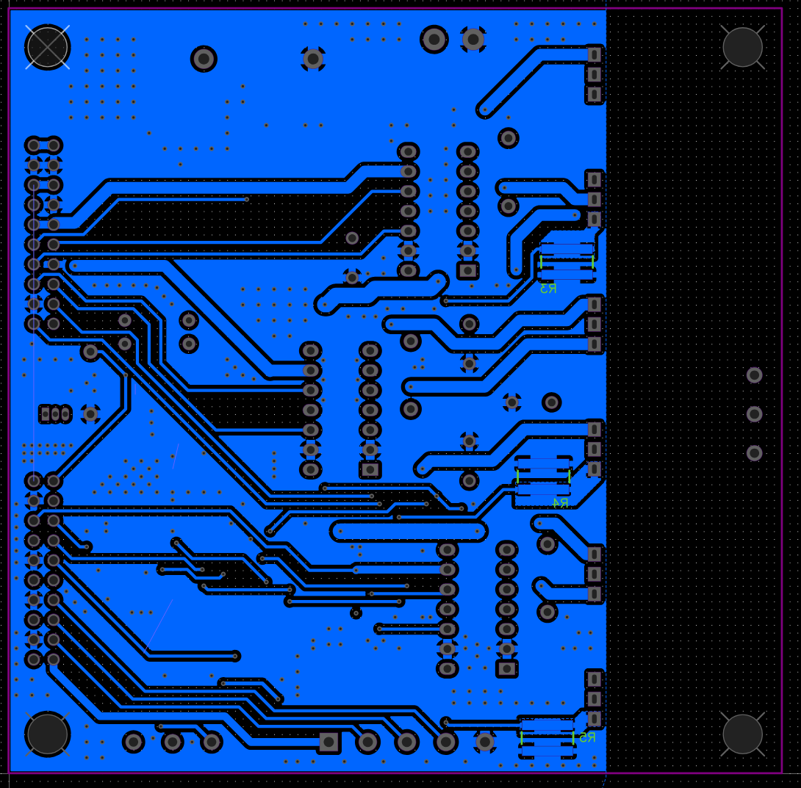
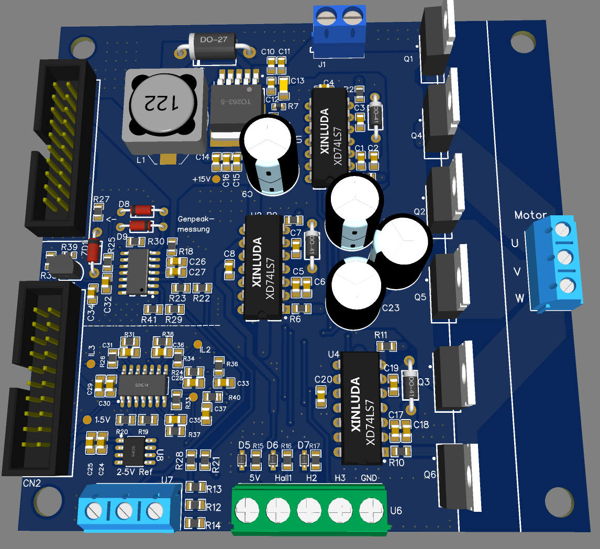

# BLDC-Treiber

Hierbei handelt es sich um einen BLDC-Treiber. Die Steuerung übernimmt eine TM..., der Daten mittels Bluetooth-Modul (auf einer selbstgebauten Adapterplatine) an ein Mobilgerät überträgt und auch von diesem gesteuert werden kann.

## Quellcode

Der Quellcode referenziert hardwareabhängige Funktionen und Definitionen der F2806-Familie, die von TI bereitgestellt werden und hier nicht mit aufgeführt sind. Das UI auf Bedienerseite wurde auf einem IPad mit der Software Pythonista in Python geschrieben. Der zugehörige Code ist hier ebenfalls nicht enthalten.

## Schaltplan

### Hauptplatine

## Layout

### Hauptplatine

## 3D

### Hauptplatine

Hier fehlt der Kühlkörper, der über den BJTs innerhalb der weißen Markierungen sitzt.

